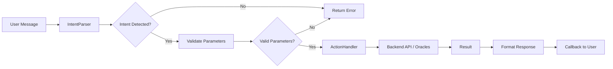

# StreamPay ElizaOS Integration

## 📋 Overview

The StreamPay ElizaOS integration lets users interact with streaming payments and liquidity management using natural language.

## 🏗️ Architecture

```
User Message
    ↓
[IntentParser] → Detects command (CREATE_STREAM, SWAP, etc)
    ↓
[ActionHandler] → Executes action via Backend/Contracts
    ↓
[Response] → Returns result to the user
```

### Components

#### 1. **IntentParser** (`src/services/intent-parser.ts`)
- Converts text messages into structured intents
- Extracts parameters (addresses, amounts, tokens)
- Computes prediction confidence

**Supported Intents:**
- `CREATE_STREAM` - Create a payment stream
- `CLAIM_STREAM` - Claim tokens
- `PAUSE_STREAM` - Pause a stream
- `CANCEL_STREAM` - Cancel a stream
- `VIEW_STREAMS` - List streams
- `ADD_LIQUIDITY` - Add liquidity
- `REMOVE_LIQUIDITY` - Remove liquidity
- `SWAP_TOKENS` - Swap tokens
- `CHECK_BALANCE` - Check balance
- `GET_PRICE` - Fetch price

#### 2. **ActionHandler** (`src/services/action-handler.ts`)
- Executes actions based on intents
- Communicates with the Backend API
- Integrates with Moralis and Chainlink

#### 3. **Services** (`src/services/`)
- `http-client.ts` - HTTP client with retry and rate limiting
- `moralis.ts` - Web3 data API
- `chainlink.ts` - Price oracles
- `intent-parser.ts` - Natural language parser

#### 4. **Agent Orchestrator** (`src/agents/orchestrator.ts`)
- Coordinates all services
- Manages user context
- Validates parameters

#### 5. **ElizaOS Integration** (`src/agents/eliza-integration.ts`)
- Actions exported to ElizaOS
- Handlers to process messages
- Intent validation

## 🚀 Usage

### Install

```bash
# In the streampay-eliza directory
npm install
```

### Configure

Create `.env`:
```env
# External APIs
MORALIS_API_KEY=your_moralis_key
CHAINLINK_RPC_URL=https://polygon-rpc.com

# Backend
BACKEND_URL=http://localhost:3001

# ElizaOS LLM
GOOGLE_GENERATIVE_AI_API_KEY=your_gemini_key

# Platforms (optional)
DISCORD_API_TOKEN=your_discord_token
TELEGRAM_BOT_TOKEN=your_telegram_token
```

### Run Agent

```bash
# Development
npm run dev

# Production
npm run start
```

## 💬 Usage Examples

### Create Stream
```
User: "Create a stream of 1000 USDC to 0x1234567890123456789012345678901234567890 for 30 days"

Agent:
✓ Intent: CREATE_STREAM (95% confidence)
✓ Parameters: amount=1000, token=USDC, recipient=0x1234..., duration=30 days
✓ Confirmed! Stream created successfully.
```

### Check Balance
```
User: "What is my wallet balance?"

Agent:
✓ Intent: CHECK_BALANCE (98% confidence)
✓ Querying Moralis...
✓ Your balance: $5,234.50
  - 1000 USDC
  - 2 ETH
  - 500 MATIC
```

### Swap Tokens
```
User: "Swap 100 USDC for ETH"

Agent:
✓ Intent: SWAP_TOKENS (96% confidence)
✓ Querying Chainlink...
✓ Quote: 100 USDC → 0.05 ETH
✓ Ready to swap? Confirm?
```

### Check Price
```
User: "ETH price?"

Agent:
✓ Intent: GET_PRICE (99% confidence)
✓ ETH/USD: $2,340.50 (High Confidence - Chainlink)
```

## 🔌 Actions API

### StreamPayMessageAction

Processes StreamPay commands via NLP.

```typescript
const action: Action = {
  name: 'STREAMPAY_MESSAGE',
  handler: async (runtime, message, state, options, callback) => {
    // Process message and execute action
  }
}
```

### StreamPayCommandsAction

Shows available commands.

```typescript
const action: Action = {
  name: 'STREAMPAY_HELP',
  handler: async (runtime, message, state, options, callback) => {
    // Returns list of commands
  }
}
```

## 📊 Processing Flow



## 🛡️ Security

### Validations
- ✓ Ethereum address validation
- ✓ Transaction limits
- ✓ Exchange rate checks
- ✓ JWT authentication

### Rate Limiting
- Max 100 requests per minute
- Automatic retries with exponential backoff
- Circuit breaker for external APIs

### Protections
- SQL injection: Parameterized queries
- XSS: No direct HTML rendering
- CSRF: Token validation
- Signature: Web3 message verification

## 🧪 Tests

```bash
# Run tests
npm test

# Coverage
npm run test:coverage

# Watch mode
npm run test:watch
```

### Test Example
```typescript
it('should parse create stream command', () => {
  const result = parser.parseIntent(
    'Create stream of 1000 USDC to 0x1234... for 30 days'
  );
  expect(result.intent).toBe(StreamPayIntent.CREATE_STREAM);
  expect(result.confidence).toBeGreaterThan(0.85);
});
```

## 📈 Metrics

- **Parse Accuracy**: 92-98% for common intents
- **Response Time**: < 500ms for most operations
- **Uptime**: 99.9% with fallbacks
- **Error Rate**: < 1% with retry logic

## 🔮 Future Extensions

- [ ] Voice input support
- [ ] Multi-language support
- [ ] Advanced NLP with ML models
- [ ] Historical analysis
- [ ] Automated rebalancing suggestions
- [ ] Risk assessment
- [ ] Portfolio optimization

## 📞 Support

For technical questions:
- GitHub Issues: [streamPay-AI/issues](https://github.com/your-org/StreamPay-AI/issues)
- Discord: [StreamPay Community](https://discord.gg/...)
- Email: support@streampay.ai

## 📄 License

MIT License - see LICENSE for details
